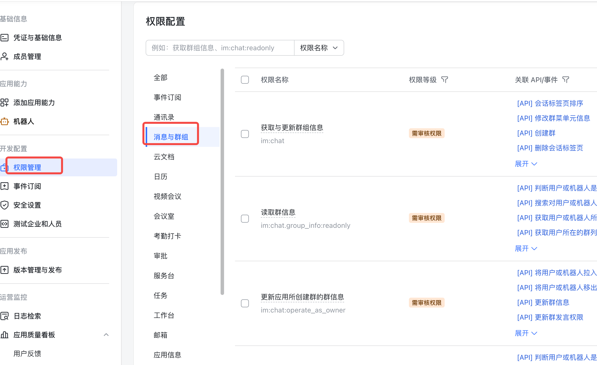
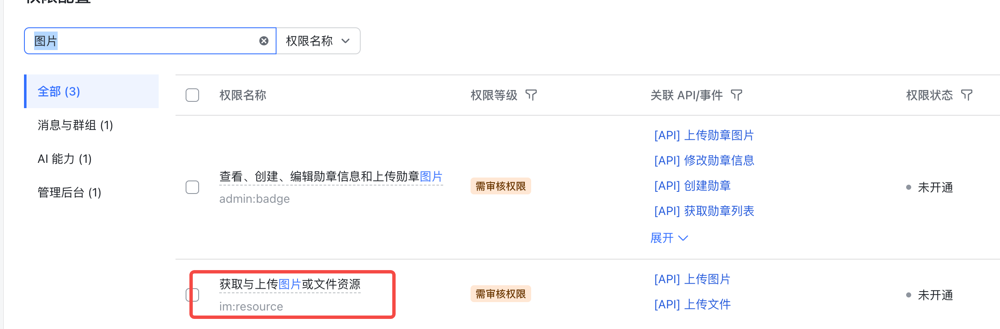
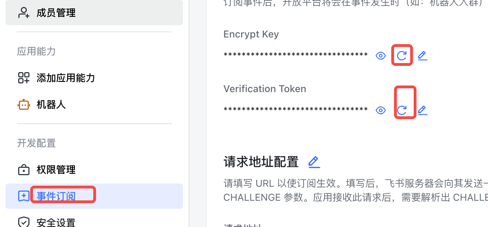
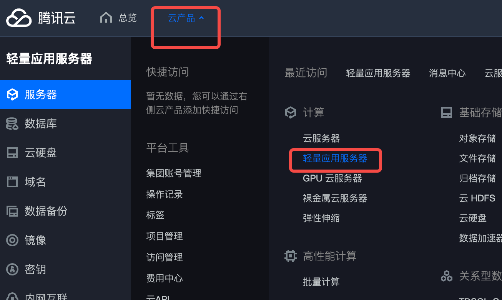
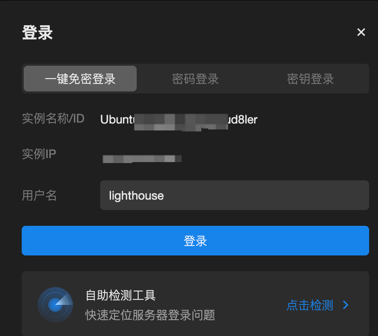
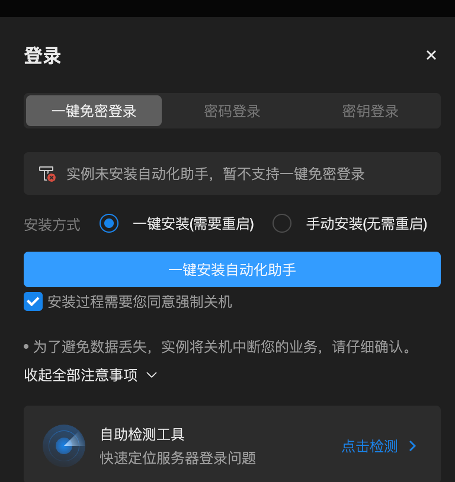
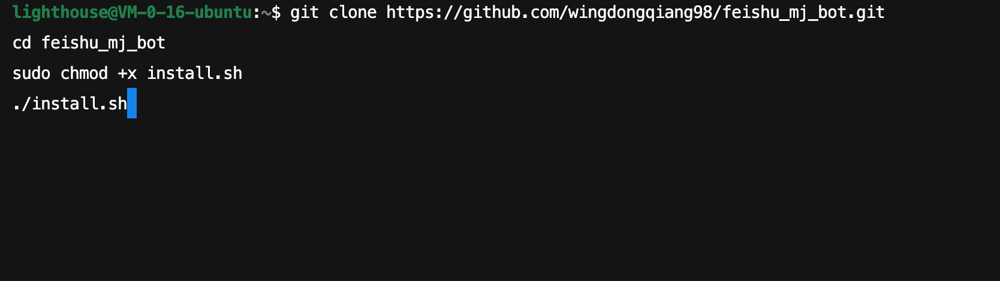
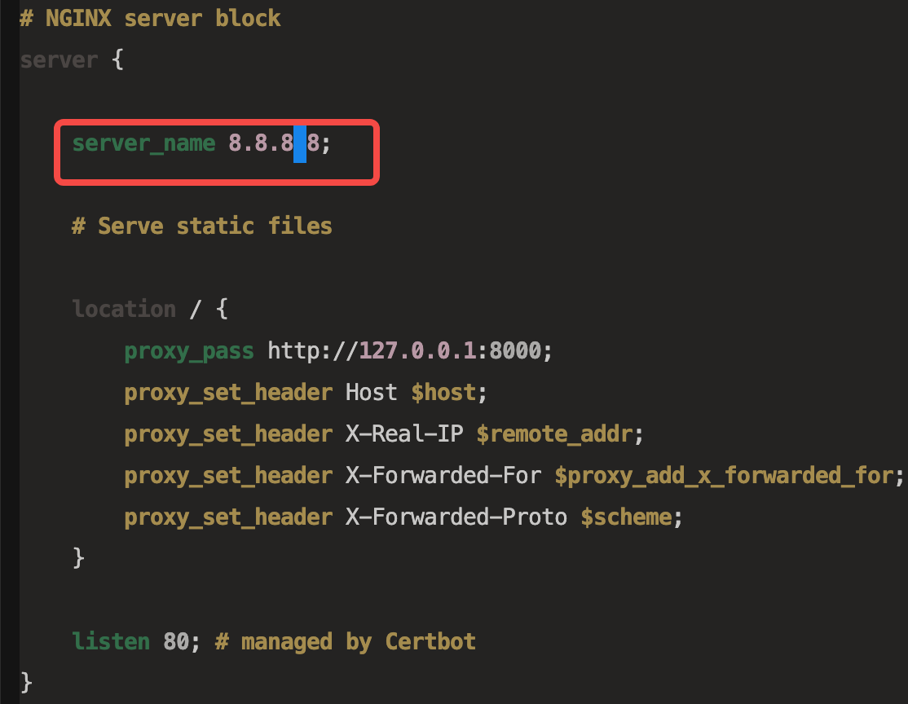
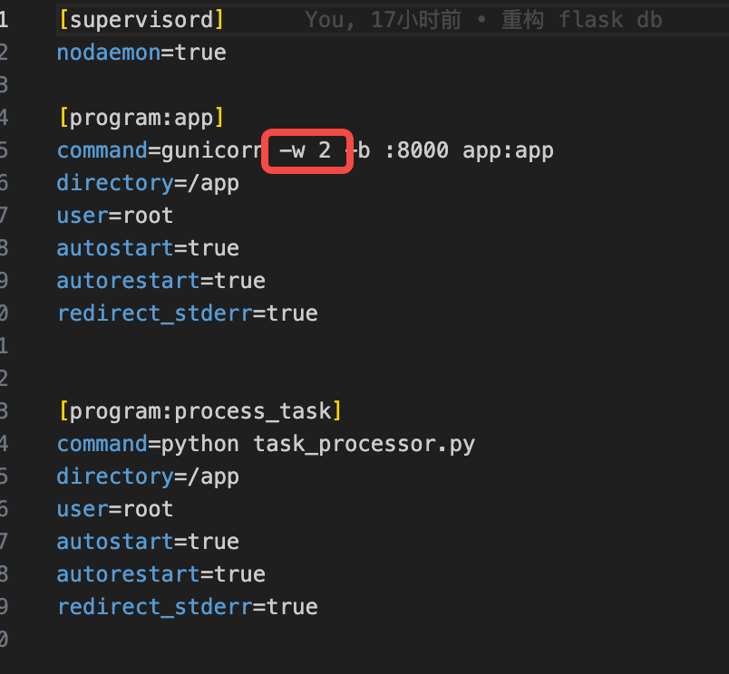
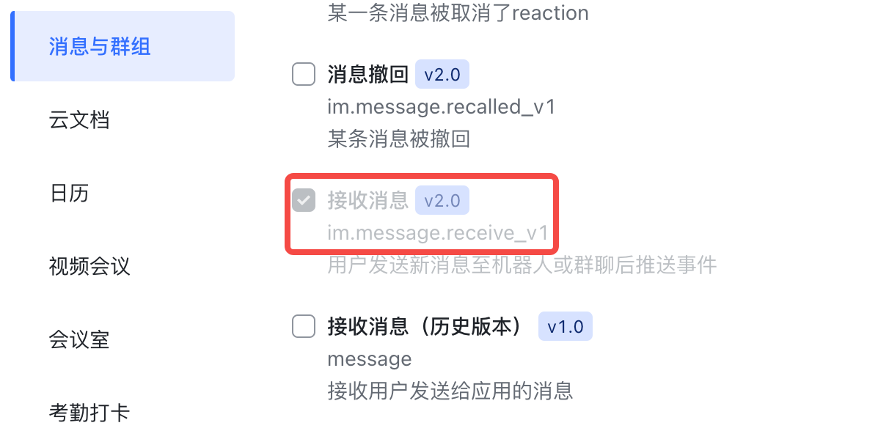

# “Midjourney For 飞书”——让先进企业先用 Midjourney

# 一、什么是“Midjourney For 飞书”

1、在飞书上搭建“MJ 机器人”，可以让飞书上的企业、组织能够在工作空间便捷使用 MJ 进行 AI 绘画；

2、Midjourney 是目前较为领先的图片大模型，可以进行较高质量的 AI 绘画创作；

3、“Midjourney For 飞书”具体效果：

1）单独聊天


2）飞书群聊


**4、此文档为 MJ 机器人搭建教程，无需开发经验即可照此步骤完成搭建，如果搭建过程中遇到问题可通过底部联系方式沟通或者找他人代为开通；**

5、我们稳定测试后取得的性能：主任务生成时长平均 1.5 分钟以内，子任务生成时长平均 0.8 分钟以内；

# 二、详细教程

## 1、需要创建飞书企业

- 如你是飞书个人版用户，需要先创建新企业，使用飞书企业版操作，否则会遇到应用创建后无法审核的情况。
- 如你是飞书企业版用户，但不是企业管理员身份，需要告知管理员，应用创建后需要企业管理员审核。

## 2、申请机器人

### 1）申请网址

[https://open.feishu.cn/app?lang=zh-CN](https://open.feishu.cn/app?lang=zh-CN)，点击创建企业自建应用，


然后为机器人添加能力，我们就用官方模版添加，点击机器人左下角的“添加”


接下来给机器人相应的权限，主要是消息和图片权限



消息里面的全选，批量开通


还有上传图片的权限，这个通过搜索的方式找到




### 2）获取 App ID， App Secret

以上操作完，我们接下来需要获取一些信息，后续部署服务器的时候用到。

App ID， App Secret


然后消息加密以及验证用的 token， 如果是空的可以点击刷新，然后点击小眼睛获取值



## 3、搭建服务

### 1）以腾讯云为例

首先需要注册腾讯云，同时需要实名认证，建议使用非大陆的服务器。




### 2）提醒：此处选用最便宜的服务器，每月仅需 35 元

如果你的绘画次数比较多，可以选一个好一点的服务器，注意看 cpu 和内存


### 3）注意：公网 IP

注意公网 IP，待会儿需要用到。同时注意上方的登陆，接下来需要登陆装一些软件。



如果第一装可能出现下方这个，确认即可



### 4）直接复制下方代码

输入下方代码，建议整个 copy

```typescript
git clone https://github.com/wingdongqiang98/feishu_mj_bot.git
cd feishu_mj_bot
sudo chmod +x install.sh
./install.sh
```



记得按 Enter 键，不然不会执行

如果出现这个，点击 Tab 键， 切换到 ok，按 ENTER 键


### 5）测试

输入如下代码：

```typescript
sudo systemctl status docker
```

如果出现如下返回就代表可以

```typescript
Output
● docker.service - Docker Application Container Engine
     Loaded: loaded (/lib/systemd/system/docker.service; enabled; vendor preset: enabled)
     Active: active (running) since Fri 2022-04-01 21:30:25 UTC; 22s ago
TriggeredBy: ● docker.socket
       Docs: https://docs.docker.com
   Main PID: 7854 (dockerd)
      Tasks: 7
     Memory: 38.3M
        CPU: 340ms
     CGroup: /system.slice/docker.service
             └─7854 /usr/bin/dockerd -H fd:// --containerd=/run/containerd/containerd.sock
```

### 6）配置 nginx

还记得那个公网 ip 吗，我们现在需要用到它。修改 files/feishu_bot_nginx.conf

vim 是个编辑器（腾讯云会直接弹出 vim），vim files/feishu_bot_nginx.conf 打开这个文件，然后按“i”键，进入编辑模式，上下左右键移动光标，退格键删除，编辑完之后按“ESC”键， 之后输入“:wq”, 这个出现在左下角，就完成编辑了

```typescript
vim files/feishu_bot_nginx.conf
```




### 7）nginx 部署

接着我们部署 nginx，直接复制下方代码到 vim，这个就可以公网访问了

```typescript
sudo cp files/feishu_bot_nginx.conf /etc/nginx/sites-available/
sudo ln -s /etc/nginx/sites-available/feishu_bot_nginx.conf /etc/nginx/sites-enabled/
sudo nginx -t
sudo nginx -s reload
sudo systemctl restart nginx
```

### 8）机器人设置

还记得之前机器人的一些设置吗？

这里我们需要用到了，copy 下面的代码，编辑这个.env 文件，MYSQL_开头的随便填，密码尽可能复杂点，  FEISHU_开头的记得对应好，不要有多余的符号，比如空格啥的

```typescript
cp .env_template .env
vim .env
```

```typescript
MYSQL_DATABASE=xxx
MYSQL_USER=xx
MYSQL_PASSWORD=sxxx
MYSQL_ROOT_PASSWORD=xxx


FEISHU_ENCRYPT_KEY=xxx
FEISHU_VERIFICATION_TOKEN=xxx
FEISHU_APP_ID=cxxx
FEISHU_APP_SECRET=xxx
MAX_THREAD_NUM=5
MJ_TASK_APIKEY=xxx
TASK_TIMEOUT=600
```

### 9）MJ_TASK_APIKEY 获取

这里的 MJ_TASK_APIKEY 这个需要到这里申请 [https://ventureai.cn/](https://ventureai.cn/) （这是 MJ API 服务，API 按照调用次数收费，初期测试就使用它所给的 30 次免费次数即可）


### 10）特殊情况

如果您的调用次数比较多，服务器比较好，需要修改 files/feishu_bot_supervisor.conf



这里制定 worker 数目，如果您的 cpu 是 4 核，可以改为 4-8，这里的是 2

设置完后执行下面代码

```typescript
sudo docker-compose up --build -d
```

看到下面这个就可以了，done 是绿色的


### 11）检测

可以在浏览器中输入：http://你的公网 ip/message

正常的应该是这个样子的


### 12）配置机器人

还没完，还有一点尾巴，我们需要配置下机器人，使其可以访问这个服务器。


请求地址填写:http://你的公网 ip/message

还有一个


用于发送卡片信息的，

消息卡片请求网址：http://你的公网 ip/card_message

**完成以上步骤，如果缺了下面的一小步，等于啥也没干😭！！！**

添加事件


接受消息的事件，就这一个，注意是 V2.0， 不是下面那个历史版本



### 13）发布机器人！

机器人还没上线，还是不能用 😭，我们先发布下 😊


保存之后还没完，还需要点击“申请线上发布”，这个需要管理员审批的，可以适当地催催主管大人


### 14）赶紧使用及意外情况

看样子流程走完了，赶紧点击“打开应用”试试吧

PS：

如果出现问题，或者没响应，可以重启下：

```typescript
sudo docker-compose restart
```

# 三、求助职业人员代为开通！

## 1、付费找他人开通

看完文档相信会难住不少非互联网行业人员，如果你不想自己搭建又特别想使用“MJ for 飞书”的话，建议付费找职业人员代为开通。

可以添加微信”wangkaisv“给你转介绍”职业人员”；

## 2、申请成为“职业人员”

我们不提供付费开通服务，如果你照此文档完成机器人搭建，可以联系我成为“职业人员”收费为客户开通 MJ 机器人。

如想申请可添加微信“wangkaisv”，有客户会代为转介绍，也可凭借此方法自行开拓客户；

# 四、成本计算

## 1、自行搭建

服务器成本：35 元/月（最低配置）

MJ API 成本：由使用次数决定，目前 fast 模式 0.2 元/次（任务成功才计费），可自行通过 [https://ventureai.cn/#/](https://ventureai.cn/#/) 注册充值；

## 2、找他人代创建

服务器、MJ API 成本同上；

代创建收费：我会建议代创建人收费 500，含首月服务器费用及 100 元 MJ API 费用，也就是代创建人服务费是 350 元左右；

# 五、未来完善计划

1、我们在考虑搭建一个“MJ for 飞书”、“MJ for 钉钉”等等“for 主流工作终端”的产品、教程系列，同时会搭建底座/中台，省去大家自行配置服务器等操作成本，争取让所有人（含毫无技术背景的人）能够在 15 分钟内便捷配置好所有 MJ 机器人；

2、可添加微信“wangkaisv”等获取完善计划动态，或者收藏本文档或者 [https://ventureai.cn/#/](https://ventureai.cn/#/) ，都会同步更新动态；

# 六、商业机会

1、其实学会这个方法之后，不仅可以为企业、组织添加 MJ 机器人，还可以添加 gpt 等一系列 AI 机器人，目前 AI 应用是无法上架飞书、钉钉等平台的，所以学会此方法可以收费帮助更多企业在工作软件中便捷使用各种 AI 能力。所以一定要服务好你的客户，可以持续为其提供各项 AI 能力；

2、社群、课程等诸多 AI 延伸组织，十分建议大家创建飞书来完成功能交付，解决“不敢传播某些工具”的隐患，让你的学员都能够在飞书里面使用 gpt、MJ。
